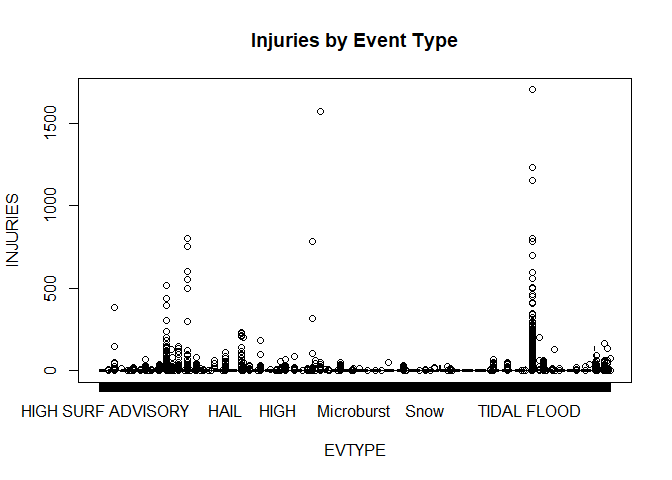
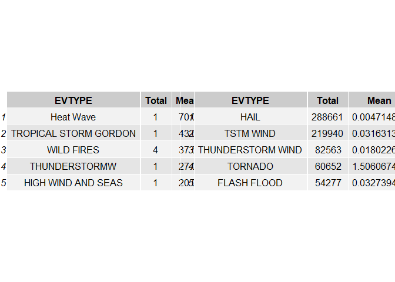

# Reproducible Research: Peer Assessment 1


## Loading and preprocessing the data

First at all loads the required libraries


```r
library(dplyr, warn.conflicts=F, quietly=T)
library(tidyr, warn.conflicts=F, quietly=T)
library(ggplot2, warn.conflicts=F, quietly=T)
library(gridExtra, warn.conflicts=F, quietly=T)
```

Data is stored into data subdirectory.
Usually, the first step should be take a look into raw data from command line: In example with more command. But in this case wew know is a csv file

We try to read the file as csv, then we take a look to data frame with head (beginning of file) and tail (end of file) and structure


```r
df <- read.csv("../data/repdata_data_StormData.csv.bz2", na.strings="")
summary(df)
```

```
##     STATE__                  BGN_DATE             BGN_TIME     
##  Min.   : 1.0   5/25/2011 0:00:00:  1202   12:00:00 AM: 10163  
##  1st Qu.:19.0   4/27/2011 0:00:00:  1193   06:00:00 PM:  7350  
##  Median :30.0   6/9/2011 0:00:00 :  1030   04:00:00 PM:  7261  
##  Mean   :31.2   5/30/2004 0:00:00:  1016   05:00:00 PM:  6891  
##  3rd Qu.:45.0   4/4/2011 0:00:00 :  1009   12:00:00 PM:  6703  
##  Max.   :95.0   4/2/2006 0:00:00 :   981   03:00:00 PM:  6700  
##                 (Other)          :895866   (Other)    :857229  
##    TIME_ZONE          COUNTY           COUNTYNAME         STATE       
##  CST    :547493   Min.   :  0.0   JEFFERSON :  7840   TX     : 83728  
##  EST    :245558   1st Qu.: 31.0   WASHINGTON:  7603   KS     : 53440  
##  MST    : 68390   Median : 75.0   JACKSON   :  6660   OK     : 46802  
##  PST    : 28302   Mean   :100.6   FRANKLIN  :  6256   MO     : 35648  
##  AST    :  6360   3rd Qu.:131.0   LINCOLN   :  5937   IA     : 31069  
##  HST    :  2563   Max.   :873.0   (Other)   :866412   NE     : 30271  
##  (Other):  3631                   NA's      :  1589   (Other):621339  
##                EVTYPE         BGN_RANGE           BGN_AZI      
##  HAIL             :288661   Min.   :   0.000   N      : 86752  
##  TSTM WIND        :219940   1st Qu.:   0.000   W      : 38446  
##  THUNDERSTORM WIND: 82563   Median :   0.000   S      : 37558  
##  TORNADO          : 60652   Mean   :   1.484   E      : 33178  
##  FLASH FLOOD      : 54277   3rd Qu.:   1.000   NW     : 24041  
##  FLOOD            : 25326   Max.   :3749.000   (Other):134990  
##  (Other)          :170878                      NA's   :547332  
##          BGN_LOCATI                  END_DATE             END_TIME     
##  COUNTYWIDE   : 19680   4/27/2011 0:00:00:  1214   06:00:00 PM:  9802  
##  Countywide   :   993   5/25/2011 0:00:00:  1196   05:00:00 PM:  8314  
##  SPRINGFIELD  :   843   6/9/2011 0:00:00 :  1021   04:00:00 PM:  8104  
##  SOUTH PORTION:   810   4/4/2011 0:00:00 :  1007   12:00:00 PM:  7483  
##  NORTH PORTION:   784   5/30/2004 0:00:00:   998   11:59:00 PM:  7184  
##  (Other)      :591444   (Other)          :653450   (Other)    :622432  
##  NA's         :287743   NA's             :243411   NA's       :238978  
##    COUNTY_END COUNTYENDN       END_RANGE           END_AZI      
##  Min.   :0    Mode:logical   Min.   :  0.0000   N      : 28082  
##  1st Qu.:0    NA's:902297    1st Qu.:  0.0000   S      : 22510  
##  Median :0                   Median :  0.0000   W      : 20119  
##  Mean   :0                   Mean   :  0.9862   E      : 20047  
##  3rd Qu.:0                   3rd Qu.:  0.0000   NE     : 14606  
##  Max.   :0                   Max.   :925.0000   (Other): 72096  
##                                                 NA's   :724837  
##            END_LOCATI         LENGTH              WIDTH         
##  COUNTYWIDE     : 19731   Min.   :   0.0000   Min.   :   0.000  
##  SOUTH PORTION  :   833   1st Qu.:   0.0000   1st Qu.:   0.000  
##  NORTH PORTION  :   780   Median :   0.0000   Median :   0.000  
##  CENTRAL PORTION:   617   Mean   :   0.2301   Mean   :   7.503  
##  SPRINGFIELD    :   575   3rd Qu.:   0.0000   3rd Qu.:   0.000  
##  (Other)        :380536   Max.   :2315.0000   Max.   :4400.000  
##  NA's           :499225                                         
##        F               MAG            FATALITIES          INJURIES        
##  Min.   :0.0      Min.   :    0.0   Min.   :  0.0000   Min.   :   0.0000  
##  1st Qu.:0.0      1st Qu.:    0.0   1st Qu.:  0.0000   1st Qu.:   0.0000  
##  Median :1.0      Median :   50.0   Median :  0.0000   Median :   0.0000  
##  Mean   :0.9      Mean   :   46.9   Mean   :  0.0168   Mean   :   0.1557  
##  3rd Qu.:1.0      3rd Qu.:   75.0   3rd Qu.:  0.0000   3rd Qu.:   0.0000  
##  Max.   :5.0      Max.   :22000.0   Max.   :583.0000   Max.   :1700.0000  
##  NA's   :843563                                                           
##     PROPDMG          PROPDMGEXP        CROPDMG          CROPDMGEXP    
##  Min.   :   0.00   K      :424665   Min.   :  0.000   K      :281832  
##  1st Qu.:   0.00   M      : 11330   1st Qu.:  0.000   M      :  1994  
##  Median :   0.00   0      :   216   Median :  0.000   k      :    21  
##  Mean   :  12.06   B      :    40   Mean   :  1.527   0      :    19  
##  3rd Qu.:   0.50   5      :    28   3rd Qu.:  0.000   B      :     9  
##  Max.   :5000.00   (Other):    84   Max.   :990.000   (Other):     9  
##                    NA's   :465934                     NA's   :618413  
##       WFO                                       STATEOFFIC    
##  OUN    : 17393   TEXAS, North                       : 12193  
##  JAN    : 13889   ARKANSAS, Central and North Central: 11738  
##  LWX    : 13174   IOWA, Central                      : 11345  
##  PHI    : 12551   KANSAS, Southwest                  : 11212  
##  TSA    : 12483   GEORGIA, North and Central         : 11120  
##  (Other):690738   (Other)                            :595920  
##  NA's   :142069   NA's                               :248769  
##                                                                                                                                                                                                     ZONENAMES     
##                                                                                                                                                                                                          :205988  
##  GREATER RENO / CARSON CITY / M - GREATER RENO / CARSON CITY / M                                                                                                                                         :   639  
##  GREATER LAKE TAHOE AREA - GREATER LAKE TAHOE AREA                                                                                                                                                       :   592  
##  JEFFERSON - JEFFERSON                                                                                                                                                                                   :   303  
##  MADISON - MADISON                                                                                                                                                                                       :   302  
##  (Other)                                                                                                                                                                                                 :100444  
##  NA's                                                                                                                                                                                                    :594029  
##     LATITUDE      LONGITUDE        LATITUDE_E     LONGITUDE_    
##  Min.   :   0   Min.   :-14451   Min.   :   0   Min.   :-14455  
##  1st Qu.:2802   1st Qu.:  7247   1st Qu.:   0   1st Qu.:     0  
##  Median :3540   Median :  8707   Median :   0   Median :     0  
##  Mean   :2875   Mean   :  6940   Mean   :1452   Mean   :  3509  
##  3rd Qu.:4019   3rd Qu.:  9605   3rd Qu.:3549   3rd Qu.:  8735  
##  Max.   :9706   Max.   : 17124   Max.   :9706   Max.   :106220  
##  NA's   :47                      NA's   :40                     
##                                            REMARKS           REFNUM      
##                                                : 24013   Min.   :     1  
##  Trees down.\n                                 :  1110   1st Qu.:225575  
##  Several trees were blown down.\n              :   568   Median :451149  
##  Trees were downed.\n                          :   446   Mean   :451149  
##  Large trees and power lines were blown down.\n:   432   3rd Qu.:676723  
##  (Other)                                       :588295   Max.   :902297  
##  NA's                                          :287433
```

## Question 1: Across the United States, which types of events are most harmful with respect to population health?

According the info provided into document: "*NATIONAL WEATHER SERVICE INSTRUCTION 10-1605*" Impact on population health, as direct as indirect is stored into field **INJURIES**. So take a look at Injuries by type of Event


```r
plot(INJURIES ~ EVTYPE, data=df, main="Injuries by Event Type")
```

<!-- -->

### Analyzing outlier

The event type with the second higher value looks a bit strange, so we dive into:

1.- First, order the data frame by Injuries in descending order

2.- Retrieve the second record to identify the event type

3.- Analyze this event 


```r
dfs <- df[order(-df$INJURIES),]
dfs[2,"EVTYPE"]
```

```
## [1] ICE STORM
## 985 Levels:    HIGH SURF ADVISORY  COASTAL FLOOD ... WND
```

```r
dfs <- subset(dfs, EVTYPE == dfs[2,"EVTYPE"] )
summary(dfs$INJURIES)
```

```
##      Min.   1st Qu.    Median      Mean   3rd Qu.      Max. 
##    0.0000    0.0000    0.0000    0.9845    0.0000 1568.0000
```

As we can see, even though the max is 1,568 the mean is almost one, so we can consider this event as an exceptional situation.


### Comparing frequencies against quantities

In order to answer to question we need to consider two situations:

A. Events not very usuals but highly dangerous
B. Frequent events although not very dangerous

Lets compare these situtations getting the top five by mean and and total:


```r
par(mfrow=c(1,2))
grouped <- df %>% group_by(EVTYPE) %>% summarise(Total=n(), Mean=mean(INJURIES))
dfMean <- grouped[order(-grouped$Mean),]
dfTotal<- grouped[order(-grouped$Total),]
grid.arrange(tableGrob(dfMean[1:5,]),
             tableGrob(dfTotal[1:5,]),
             nrow=1)
```

<!-- -->

On the left we can see not very frequency events but dangerous; in example,  we have only 4 Wild Fires but each time this time occurs a lot of people is injuried.

On the right side we have got another vision, each event is not very harmful but they are so frequents that we need to consider as dagerous for population.

So, in my opinion, the answer to question is:

** 1. Tornados** They are very common
** 2. Tropical Storms and Winds** Also common in South of Country and eventually very harmful
** 3. Heat Wave**
** 4. Wild Fires** It looks exists protocols against this because there are not many events, but the mean of injuries is very high: 37.5


